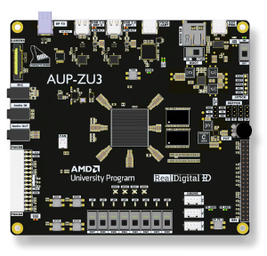

## End-to-End Machine Learning Hardware Acceleration on the AMD AUP-ZU3 SoC/FPGA

The AUP-ZU3 is an academic System on a Chip (SoC) development board, combining a programmable FPGA with a processing system (PS). It runs Python via the open-source PYNQ framework.

The FPGA and processor can be used separately or together to create high-performance systems. The board represents the next generation of PYNQ platforms, an open-source project from AMD that simplifies the use of its platforms through Python, making it easier to leverage programmable logic and build more powerful and versatile electronic systems.

Source: https://xilinx.github.io/AUP-ZU3/

----
This work was supported in part by the [AMD University Program](https://www.amd.com/en/corporate/university-program.html) 

