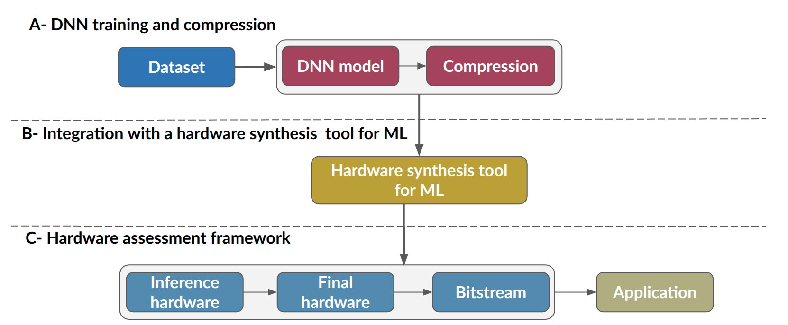

## Machine Learning and FPGA Acceleration

Machine Learning (ML) has become a foundational technology across scientific and industrial domains, driven by the increasing availability of data and the demand for high-performance computation. Traditional processing platforms such as CPUs and GPUs offer general-purpose architectures that, while powerful, can face limitations in latency, energy efficiency, and task-specific optimization. In this context, Field-Programmable Gate Arrays (FPGAs) have emerged as an alternative for ML acceleration due to their reconfigurable hardware fabric. This flexibility enables the implementation of customized computation pipelines tailored to the structure of a given ML model, providing substantial improvements in throughput and power efficiency, particularly for real-time inference and edge-oriented applications.

## End-to-end workflow
Throughout these projects, the focus will be on employing an end-to-end workflow to map deep neural networks (DNNs) onto an SoC/FPGA platform, following the methodology presented by Molina et al. [1]. The main stages of this workflow are illustrated in the figure below. The process begins with the dataset used to train and compress [2] the target model. From the trained model, a data structure is generated containing the necessary information about its layers, weights, and biases. This representation is then passed to a hardware synthesis tool specialized for machine learning, which translates the DNN into a hardware architecture suitable for FPGA implementation. Finally, the resulting inference accelerator is integrated into an evaluation environment to verify its correct operation on the SoC/FPGA device.

To implement this methodology, we use hls4ml (High-Level Synthesis for Machine Learning) [2], a framework that converts trained neural network models into hardware descriptions compatible with Xilinx’s Vitis HLS tools. This step acts as a bridge between the software-level model and its realization in FPGA hardware.

For the hardware assessment stage, the generated accelerator is deployed on a PYNQ-enabled Zynq platform. Here, the PYNQ framework provides a Python-based runtime environment that simplifies interaction with custom hardware. Data transfers between the processing system (PS) and the accelerator in the programmable logic (PL) are handled through AXI Direct Memory Access (DMA), ensuring efficient movement of input and output data. This setup enables functional verification of the accelerator, as well as performance measurements such as latency and throughput, directly on the hardware platform.

# References 

[1] Molina, R. S., Morales, I. R., Crespo, M. L., Costa, V. G., Carrato, S., & Ramponi, G. (2024). An End-to-End Workflow to Efficiently Compress and Deploy DNN Classifiers On SoC/FPGA. IEEE Embedded Systems Letters, 16(3), 255-258. 

[2] Dantas, P. V., Sabino da Silva Jr, W., Cordeiro, L. C., & Carvalho, C. B. (2024). A comprehensive review of model compression techniques in machine learning. Applied Intelligence, 54(22), 11804-11844.

[3] https://fastmachinelearning.org/hls4ml/

---

This work was supported in part by the [AMD University Program](https://www.amd.com/en/corporate/university-program.html) 

