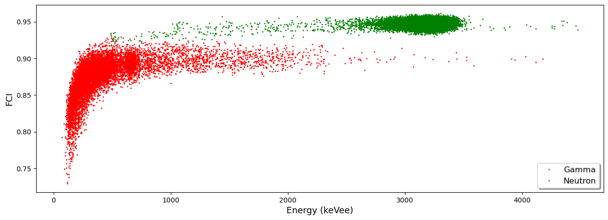
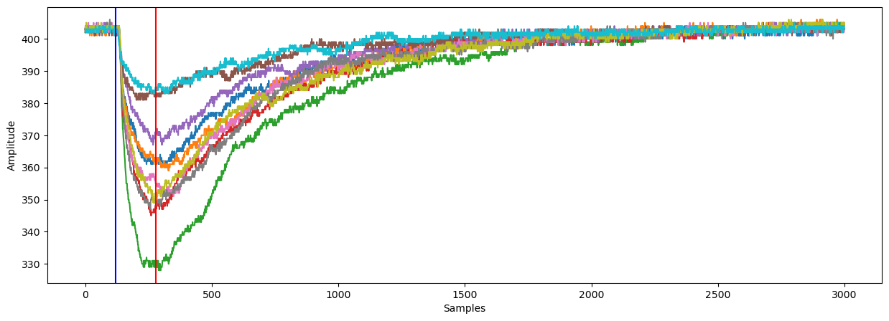
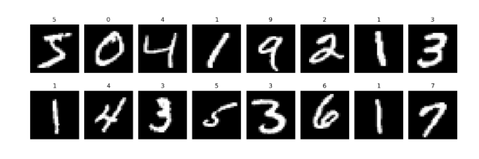
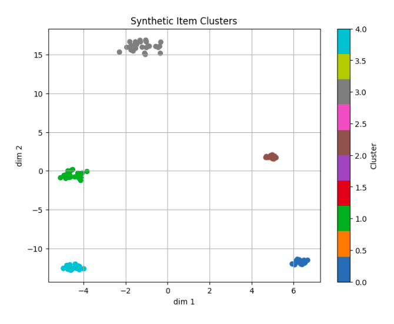
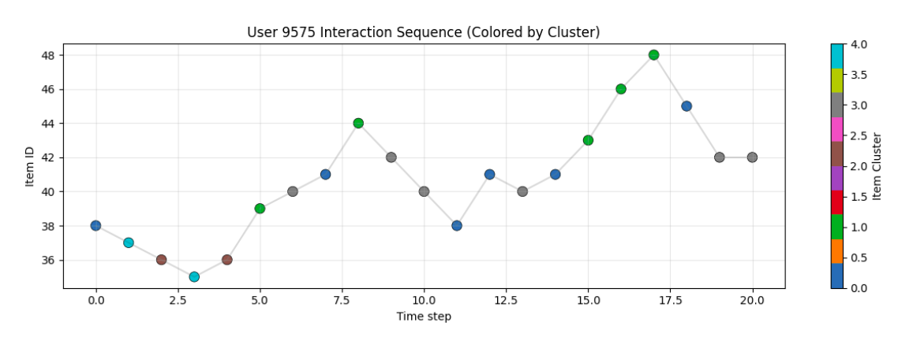

## The Three Accelerator Projects

### Gamma/Neutron Discrimination (G/N)

The objective is to show how simple, low-latency FPGA models can effectively process raw physical signals.

Key features:
- Raw detector-like data is used as input (no images; 1D pulses).
- Signal samples are fed directly to the network, emulating what a real detector would produce.
- The neural architecture is intentionally small, but uses high-precision fixed-point arithmetic (e.g., 16–24 bits) to preserve accuracy.
- Demonstrates that a lightweight FPGA model can achieve performance comparable to the full Keras/QKeras version, thanks to an ensemble of compression techniques.

This project uses the workflow proposed by Molina et al. [1] (without Bayesian optimization).

#### Dataset

The experimental data for this project were collected at the Neutron Science Facility, IAEA Laboratories, in Seibersdorf, Austria. Over 100,000 raw pulses were recorded for subsequent offline pre-processing. 

The image below depicts the gamma/neutron (g/n) distribution obtained using the method described in [2], employed to generate the labeled dataset, consisting of two classes: class 0 corresponding to g and class 1 to n.

  

As demonstrated in the literature, the primary information in these types of signals is concentrated in the leading edge. The image below displays some of the original signal traces, along with the corresponding window (marked by red and blue vertical lines) that highlights the portion of the signal being cropped. For this project, the signals used will consist of 161 samples, extracted specifically from the leading edge.

  

### MNIST Classifier

This project serves as the canonical 2D image case study using grayscale 28×28 MNIST digits [3].

Key features:
- The objective is to provide a simple, visual example of the full FPGA deployment process with image data and 2D convolution layers.
- The pipeline mirrors the G/N project but uses a 2D convolutional model.
- Useful as a reference for image-based inference running on FPGA hardware.
- Demonstrates how to convert image inputs into AXI-Stream format, including fixed-point encoding.
- Demonstrates that a lightweight FPGA model can achieve performance comparable to the full Keras/QKeras version, thanks to an ensemble of compression techniques.

This project uses the workflow proposed by Molina et al. [1] (without Bayesian optimization).

#### Dataset

MNIST is a widely used dataset of handwritten digits. It contains 70,000 grayscale images of digits from 0 to 9, each of size 28×28 pixels. MNIST is commonly used for training and testing image classification algorithms and serves as a beginner-friendly benchmark in machine learning and deep learning research.

  

### Recommender System

This project focuses on sequential processing and recommendation systems using a synthetic dataset designed to mimic user–item interaction sequences 

Key features:
- The workflow starts with a GRU-based model trained for sequential recommendation tasks. The model is then optimized through unstructured pruning, removing low-magnitude weights and reducing parameter count without significantly impacting accuracy.
- After pruning, the network is quantized to 16-bit fixed-point during the hls4ml conversion stage, enabling efficient hardware implementation while retaining numerical stability.
- Post-implementation reports confirm feasible resource usage and accurate inference, evaluated through Top-K and MRR metrics.
- This approach enables efficient FPGA deployment of a sequential recommender.

#### Dataset

We generated a lightweight synthetic dataset designed to mimic user–item interaction sequences typically found in real recommendation systems (e.g., MovieLens, Amazon).

Each user is modeled as a sequence of item interactions, with temporal order preserved. Items are grouped into hidden “taste clusters,” and users tend to interact with items from a few preferred clusters. This creates natural patterns such as popularity, co-occurrence, and sequential transitions. 

The dataset is fully reproducible, privacy-safe, and small enough for FPGA-friendly model experimentation (RNN/GRU or MLP-based recommenders).

In the following image, each dot represents a synthetic item, projected to 2D using t-SNE so it can be visualized. Items of the same type are grouped by color, showing that the dataset was generated with clearly distinct item categories, giving the model well-defined patterns to learn from

  

Typical User Interaction Sequence: This plot shows a user’s time-ordered interaction history, where each point represents an item consumed and the color corresponds to its latent cluster. It illustrates realistic behavioral patterns such as staying within a cluster, shifting preferences, and transitioning between item groups. Such temporal structure is essential for sequential recommendation models like GRUs, which learn user dynamics over time.

  

> **NOTE:** Keep in mind that the provided scripts assume the folder hierarchy of the repository.
Make sure you keep the same directory structure when running the notebooks or executing the automation scripts.

### Model Performance Evaluation

The metrics used differ because each problem requires a different way of measuring model quality, and the hardware evaluation should reflect the true objective of the model.

| Project        | Task Type               | Metric            | Reason                                                       |
|----------------|--------------------------|--------------------|---------------------------------------------------------------|
| G/N            | Binary classification    | Confusion matrix   | Captures per-class errors and false positives/negatives.      |
| MNIST          | Multi-class classification | Confusion matrix | Reveals digit-specific confusions; easy HW/SW comparison.     |
| MovieLens RNN  | Ranking / recommendation | Top-K, MRR         | Measures ranking quality rather than hard labels.             |

# References 

[1] Molina, R. S., Morales, I. R., Crespo, M. L., Costa, V. G., Carrato, S., & Ramponi, G. (2024). An End-to-End Workflow to Efficiently Compress and Deploy DNN Classifiers On SoC/FPGA. IEEE Embedded Systems Letters, 16(3), 255-258. 

[2] Morales, I. R., Crespo, M. L., Bogovac, M., Cicuttin, A., Kanaki, K., & Carrato, S. (2024). Gamma/neutron classification with SiPM CLYC detectors using frequency-domain analysis for embedded real-time applications. Nuclear Engineering and Technology, 56(2), 745-752.

[3] Deng, L. (2012). The mnist database of handwritten digit images for machine learning research [best of the web]. IEEE signal processing magazine, 29(6), 141-142.

---

This work was supported in part by the [AMD University Program](https://www.amd.com/en/corporate/university-program.html) 

