## Multi-Layer Perceptron

## 1. Clone the Repository

First, clone the project repository to your local machine:


```bash
# Clone the repository
git clone <repository-url>
cd <repository-name>

```

This will download all the project files, including the environment configuration needed for the next steps.

## 2. Environment Setup

This step creates and activates the Conda environment required for the projects. In the terminal, execute the following lines (the environment file is located at environment/environment.yaml).

```bash
# Create the environment
conda env create -f environment/environment.yaml
conda activate neuralEnv10
```


The command `conda env create -f environment/environment.yaml` reads the `environment.yaml` file and installs all the specified dependencies into a new Conda environment called `neuralEnv10`.

Once the installation is complete, `conda activate neuralEnv10` activates the environment so that all subsequent commands run with the correct versions of Python and the required libraries.

After activating the environment, you are ready to proceed with the next steps.


### 2.1 Jupyter Notebook Environment

The notebooks in this project can be executed in any Jupyter-compatible environment (VS Code, Jupyter Notebook, JupyterLab, etc.).

>**Note**: Before starting, make sure the Conda environment `neuralEnv10` is correctly created and activated.

#### 2.1.1 Selecting the Kernel
Open the notebook `mlp-training.ipynb` located in the **01-mlp/01.training** folder.

Ensure that the notebook kernel is set to: `Python 3.10 (neuralEnv10)`

#### 2.1.2 Using Visual Studio Code (example)

If you are using **Visual Studio Code**:

1. Open the project folder in VS Code.
2. Open the notebook `mlp-training.ipynb` located in the **01-mlp/01.training** folder.
3. Click **Select Kernel** (top-right corner).
4. Choose **Python Environments…** and select  
   **`neuralEnv10 (Python 3.10.18)`**.

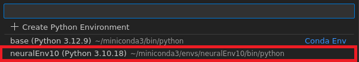

> **Note:**  
> If you are using a different Jupyter interface, simply select `neuralEnv10`
> as the active kernel. 


## 3. G/N Project

In this project, the main objective is to discriminate between two classes, gamma (class 0) and neutron (class 1). 

###  3.1 Directory & File Structure
``` text
01-mlp:
│── 00.datasets
│   ├── gamma_label.csv
│   ├── neutron_label.csv
│   └── test.csv
│── 01.training
│   ├── mlp-training.ipynb
│   └── models
│       ├── studentModel_GN.h5
│       └── teacherModel_GN.h5
│── 02.hls4ml
│   ├── mlp-hls4ml.ipynb
│   └── output
│── 03.hls
│   ├── build_accel.tcl
│   ├── myproject_gn_accel.cpp
│   └── myproject_gn_accel.h
│── 04.hw
│   ├──gn_bd.tcl
│   └── ip
└── 05.pynq
    └── 01-mlp.ipynb
    ├── bd_wrapper_gn.xsa
    ├── gn_test.csv
    └── utils.py

common/
└── notebook_utils/
``` 

###  3.2 Training, Compression, and hls4ml
The primary motivation for applying compression techniques is to enable a fully on-chip deployment of the machine learning model, thereby avoiding external memory accesses and achieving low-latency, high-efficiency inference on the FPGA.

In this project, the compressed model is produced through a combination of quantization-aware pruning and knowledge distillation, following the methodology described in [1]. Once the compressed model is obtained, the next step is to generate the corresponding High-Level Synthesis (HLS) project, which will produce the IP core responsible for executing inference on the FPGA.

After synthesizing the *hls4ml* project and reviewing the hardware metrics, such as latency, throughput, and LUT/FF/DSP/BRAM utilization, the workflow proceeds to FPGA integration. To enable this, an AXI-based wrapper must be added around the HLS-generated model, typically incorporating:

- AXI4-Stream interfaces for high-throughput data movement
- AXI-Lite interfaces for configuration and control

This wrapper allows the IP core to be driven by a DMA engine or any other AXI infrastructure within the FPGA platform, enabling efficient inference controlled by the processing system or by external data sources.

A detailed walkthrough of these steps is provided in the Jupyter Notebook files included in the repository:

**Files:**
1. `01-mlp/01.training/mlp-training.ipynb` (Model training and compression)
2. `01-mlp/02.hls4ml/mlp-hls4ml.ipynb` (hls4ml conversion and IP core generation)

After completing these notebooks, return to the Wiki to proceed with the hardware integration.

**Disclaimer:** The reported metrics (latency, throughput, LUT/FF/DSP/BRAM utilization) may vary due to differences in model training, quantization, or other stochastic aspects of machine learning.

### 3.3 Vivado Block Design
Once the IP core has been generated, you can proceed to create the corresponding hardware design in Vivado, which will later be integrated into the PYNQ framework as part of the final deployment. 

> **Note:**  
> Before starting, make sure to download the board files and copy them into the following directory:  
> `<Vitis installation folder>/Vitis/2024.1/data/boards`
>
> The board files can be found at:  
> https://github.com/RealDigitalOrg/aup-zu3-bsp/tree/master/board-files

> Restart Vivado/Vitis after copying the board files to ensure they are detected.


The vivado project can be created using one of the following approaches:
- the [GUI-based flow](#gui-based-flow), which uses the Vivado GUI, or
- the [TCL-based flow](#tcl-based-flow), which runs the provided TCL script.


#### 3.3.1 GUI-based flow
1.   Open _Vivado 2024.1_.

2.   From the **Quick Start** menu, click  to start the wizard or click **File → Project → New**. You will see **Create A New Vivado Project** dialog box in the **New Project** window. Click **Next**. Use the information in the table below to configure the different wizard options:

| Wizard Option | System Property | Settings | 
|---------------|-----------------|----------|
| Project Name | Project Name | mlp |  
|  | Project Location | `ml-aupzu3` |
|  | Create Project Subdirectory | Check this option. | 
| Click **Next** |  |  |  
| Project Type | Project Type | Select **RTL Project**. Keep  unchecked the option `do not specify sources at this time`.  | 
| Click **Next** |  |  | 
| Add Sources | Do nothing |  |  
| Click **Next** |  |  |  
| Add Constraints | Do Nothing |  |  
| Click **Next** |  |  |  
| Default Part | Specify | Select **Boards** |  
|  | Board | Select **Zynq UltraScale+ AUP-ZU3 8GB Development Board** |  
| Click **Next** |  |  |  
| New Project Summary | Project Summary | Review the project summary |  
| Click **Finish** |  |  | 

After clicking **Finish**, the **New Project Wizard** closes and the created project opens in the Vivado main GUI, which is divided into two main sections: the Flow navigator and the Project manager. In the Project manager area, you can view the **Project Summary**,  which provides an overview of the project settings, selected board part, and synthesis details. For more details click [here](https://china.xilinx.com/support/documents/sw_manuals/xilinx2022_2/ug892-vivado-design-flows-overview.pdf). 

By selecting the **AUP-ZU3** platform, the **IP Integrator** is board-aware and it will automatically assign dedicated PS IO ports to physical pin locations mapped to the specific board peripherals when the **Run Connection** wizard is used. Besides doing a pin constraint, **IP Integrator** also defines the appropriate I/O standards (e.g., LVCMOS 3.3, LVCMOS 2.5, etc) for each I/O pin, saving the designer time and reducing the potential for manual errors.

3. Click **Create Block Design** in the **Flow Navigator** pane under the **IP Integrator**.


<p align="center">
  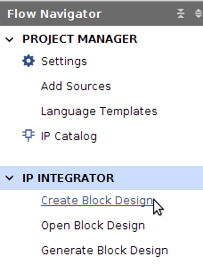
</p>


4.  In the **Create Block Design** popup window, set the **Design Name** as *bd_gpio* and leave the other options as default.

<p align="center">
  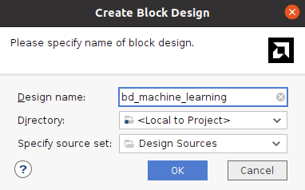
</p>


In the main GUI, on the **Block Design** section, a new blank Diagram canvas will be presented, which will be used to create the hardware design to be implemented on the Zynq device.

5. The first step is to add the ZYNQ7  **Processing System (PS)** block. To do this, either click the **Add IP** icon  located on the toolbar in the Diagram section, or right-click on the blank canvas area and select **Add IP** from the available options.


<p align="center">
  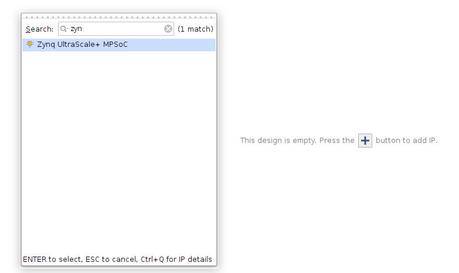
</p>

A small window will come up showing the available **IPs** (they are the Intellectual Property cores that are already available). To search for the **PS7 IP** core, either scroll to the bottom of the IP list or use the search bar with the keyword **zynq**. Double click on the **Zynq UltraScale+ MPSoC** to select it and add it to the canvas. 

The **Zynq UltraScale+ MPSoC** block will then appear in the block diagram canvas. The I/O ports visible on the block are defined by its default configuration settings.


<p align="center">
  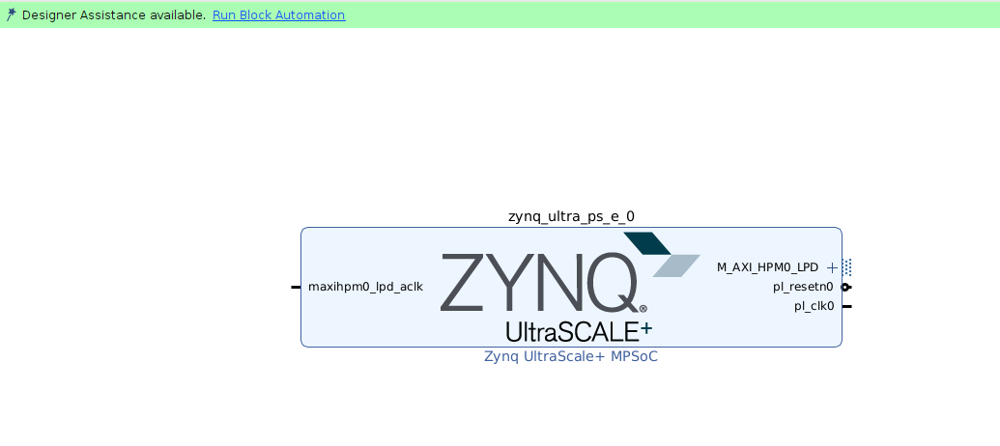
</p>

6. Click **Run Block Automation**, available in the green information bar.

<p align="center">
  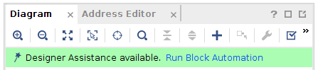
</p>

7. Then, in the **Run Block Automation** window, select **zynq_ultra_ps_e_0**. Make sure **Apply Board Presets** is **checked**, and leave everything else as default. Click **OK**.

8. Double click in the **Zynq UltraScale+ MPSoC** block to open the Processing System **Re-customize IP** window **All the necessary configurations for the processing unit are completed in this section**. 

	The **Zynq block design** illustration should now be visible, displaying the various configurable sections of the Processing System. Remember, the green blocks represent the configurable components.


<p align="center">
  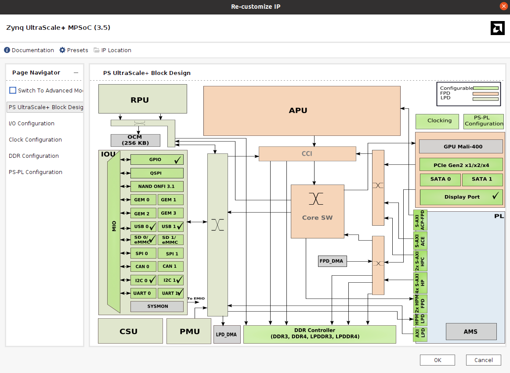
</p>

9. Click on the **PS-PL Configuration** at the **Page Navigator** pane. Expand **PS-PL interfaces** and verify that the AXI HPM0 LPD is checked. Then, expand **Slave Interface/AXI HP** and select AXI HP0 FPD.


<p align="center">
  
</p>

10. Click on the **Clock Configuration** option and expand **PL Fabric Clocks**. Verify that **FCLK_CLK0** is enabled and its frequency is set to 100 MHz. **This section defines the clock frequency for the PL (Programmable Logic) digital design**.


11. Finish with the **Zynq** (processing_system7_0) configuration by clicking the  button in the **Re-Customize** IP window.

12. Add the **AXI Direct Memory Access (DMA)** IP core. 

<p align="center">
  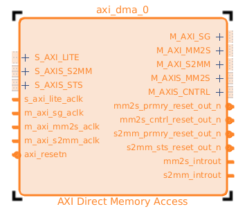
</p>

13. Once it has been added to the block design, double-click on the IP core and configure it as shown in the following figure.


<p align="center">
  
</p>

14. Click **Run Connecton Automation**. In the pop-up window click **Ok**. 


<p align="center">
  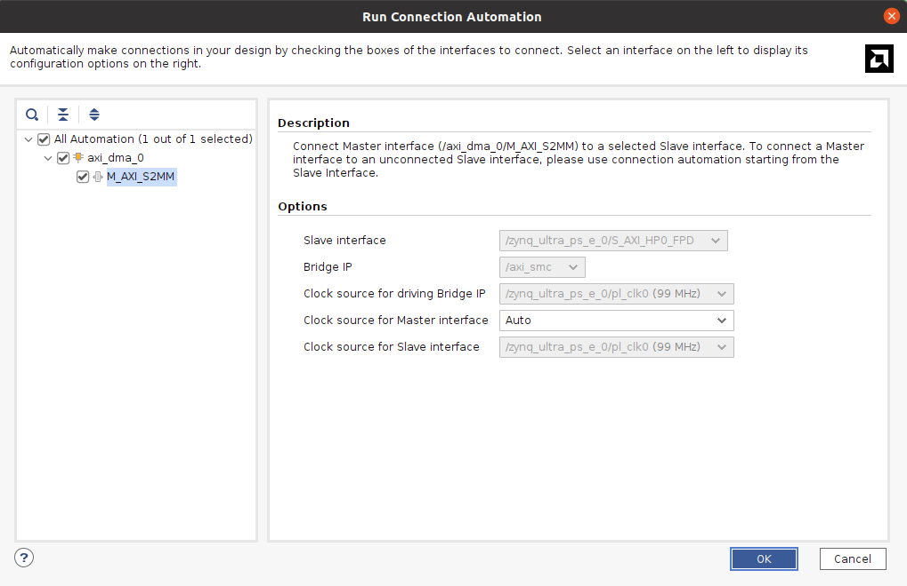
</p>


15. Add the inference IP core. To do so, in the **Flow Navigator** pane, go to  the **Project Manager** area and click on **Settings**.

16.  Navigate to **IP → Repository**, click **Add Repository**, and select , and select **either**:
- the folder from the cloned repository, or
- the folder where the IP was generated using **hls4ml**.

> **Note:**  
> If you generated the IP using hls4ml, make sure to select the output directory that contains the IP definition files.


17.  Add the IP core to the block design. For this project, search for **`myproject_gn_accel`**. 


<p align="center">
  
</p>


18. Execute Run Connection Automation. 

19. Perform the following connections 

<p align="center">
  
</p>


<p align="center">
  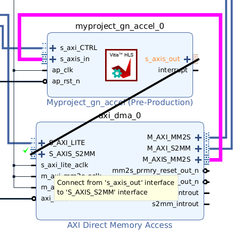
</p>

<!-- The final connections between DMA and the Inference IP core should look as follows:

<p align="center">
  
</p> -->


Finally, the complete block design is illustrated in the following figure. 

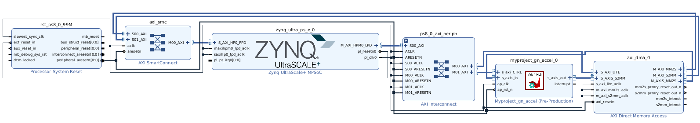

20. The next step is to create the HDL wrapper.Go to **Sources** under the **Design Sources** folder, right-click on **`bd_machine_learning`**, and select **Create HDL Wrapper**, as shown in the following figure.


<p align="center">
  
</p>


21. Once the HDL wrapper has been generated, click on **Run Bitstream**.  
Vivado will display a dialog indicating that no synthesis results are available. Click **Yes** to allow Vivado to run synthesis. The tool will then automatically proceed with **implementation** and **bitstream generation**.

22. After the bitstream generation is complete, export the hardware design.
Go to **File → Export → Export Hardware**.  
In the export dialog, make sure that **Include bitstream** is enabled, and complete the export process. This will generate the `.xsa` file required for the next steps.

At this point your hardware design and configuration are set and you can proceed to the PYNQ integration.

#### 3.3.2 TCL-based flow


1. Open _Vivado 2024.1_.

2.  From the **Quick Start** menu, click  to start the wizard or click **File → Project → New**. You will see **Create A New Vivado Project** dialog box in the **New Project** window. Click **Next**. Use the information in the table below to configure the different wizard options:


| Wizard Option | System Property | Settings | 
|---------------|-----------------|----------|
| Project Name | Project Name | mlp |  
|  | Project Location | `ml-apuzu3` |
|  | Create Project Subdirectory | Check this option. | 
| Click **Next** |  |  |  
| Project Type | Project Type | Select **RTL Project**. Keep  unchecked the option `do not specify sources at this time`.  | 
| Click **Next** |  |  | 
| Add Sources | Do nothing |  |  
| Click **Next** |  |  |  
| Add Constraints | Do Nothing |  |  
| Click **Next** |  |  |  
| Default Part | Specify | Select **Boards** |  
|  | Board | Select **Zynq UltraScale+ AUP-ZU3 8GB Development Board** |  
| Click **Next** |  |  |  
| New Project Summary | Project Summary | Review the project summary |  
| Click **Finish** |  |  |  


##### Add the IP cores repository

In this section you'll import the external IP core into the project: **HLS-based ML inference**.

1. Click **Settings** in the Flow Navigator. Expand the **IP** option on the left pane of the Project Settings form.

2. Click on **Repository**, then click on the **Add** icon.

3. Browse to `01-mlp/02.hls4ml/output/myproject_accel_prj/solution1/impl` directory, select it, and finally click on the **Select** button. This directory contains the IP core exported from the HLS project.

> **Note:**  
> A pre-generated IP core is provided in the **`01-mlp/04.hw/ip`** folder (unzip it before adding to Vivado).

<p align="center">
  
</p>

4. The **GN_inference IP** core should appear under **IPs** in the **Add Repository** window.

5. Click **OK** to finish the process in both windows.

##### Block Design

We will make use of the Tool Command Language (**TCL**) to build a Block-level design from the provided source files and a TCL script. You'll notice how Vivado will start building the system from scratch until resulting into a synthesizable design. This is a clean way to work with version control tools (such as Git) in collaborative environments.

1. This project uses a pre-generated block design (BD). To re-generate it, in the Vivado lower pane, click the **Tcl Console** tab.

2. To find out which directory you are working on, type in the TCL command line `pwd`. This will print out the current working directory.


``` bash
pwd
```

3. Move your working directory to the **bd** directory. Hence, use the `tcl` command **cd** to change the directory. Type:

``` bash
cd <user-directory>/aup-zu3-amd-ml/01-mlp/04.hw
```

4. A TCL file can be sourced from Vivado. To recreate the block design you will need a `tcl` command file, that in this case is **gn_bd.tcl**. To recreate the block design, type in the Tcl console:

``` bash
source ./gn_bd.tcl
```

>**Note:** When you trigger the execution of a Tcl script in the Vivado, a progress bar appears, and all operations within Vivado are halted until the script ends running.

As result of the process, you will get a block design with these main components: Zynq7 Processing system, ComBlock, HLS-based inference. 

5. **Regenerate Layout** and take a closer look at the design, the connections, and the configuration registers. The final block design should look as follows:


6. **Generate output products** of the block design.

7. **Create HDL wrapper** of the block design and set it as **Top**. 

8. In the **Flow Navigator** pane click on **Generate Bitstream** and click **Yes** if prompted to save the **Block Diagram**. Also, click **Yes** when prompted to launch synthesis and implementation. Click **Cancel** when prompted to Open the **Implemented Design**.

9. Since you need to create an application to use your design, you have to export the generated hardware to the Vitis environment. Click on: **File -> Export -> Export Hardware**. Since there is some logic in the PL part of the Zynq, the respective bitstream has to be included in the export task. Hence, be sure to check the **Include bitstream** box. Then click **Next**.

10. In the following window, change the _XSA file name_ to **bd_wrapper_gn.xsa**. Click **Next**, and then **Finish**.

At this point your hardware design and configuration are set and you can proceed to the PYNQ integration.


### 3.4 PYNQ Integration
Once the corresponding hardware has been generated in Vivado, the next step is to move to the PYNQ framework and interact with the AUP-ZU3 board. This allows us to evaluate how the IP core produced by hls4ml behaves during the inference process directly on the FPGA. Python provides a high-level interface to control and use the generated hardware, making it easier to test, debug, and validate the deployed accelerator.

The first step is to set up the board.

To do so, follow the instructions provided in the official PYNQ documentation:
PYNQ Board Setup Guide: https://pynq.readthedocs.io/en/latest/getting_started.html

This guide covers SD-card preparation, image installation, network configuration, and initial board access via Jupyter Notebook.

If the setup completed successfully, you should now be inside the PYNQ Jupyter home environment, accessible from your browser at: 192.168.3.1


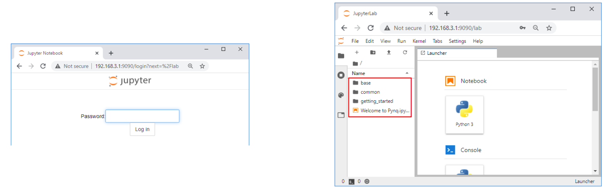

For the g/n project, upload the contents of 01-mlp/05.pynq into the Jupyter home area. It is recommended to create a dedicated folder to keep the files organized.

> **Note:**  
> The `.xsa` file may be either the one generated by the user or the pre-provided file included in the repository within the **`01-mlp/04.hw`** folder.

``` 
01-mlp/05.pynq/
├── 01-mlp.ipynb
├── bd_wrapper_gn.xsa
├── gn_test.csv
└── utils.py
 ```  

Inside the PYNQ framework, create a folder named `test_dataset`, move `gn_test.csv` into it, open the `01-mlp.ipynb` notebook and continue from there.


---

This work was supported in part by the [AMD University Program](https://www.amd.com/en/corporate/university-program.html) 
